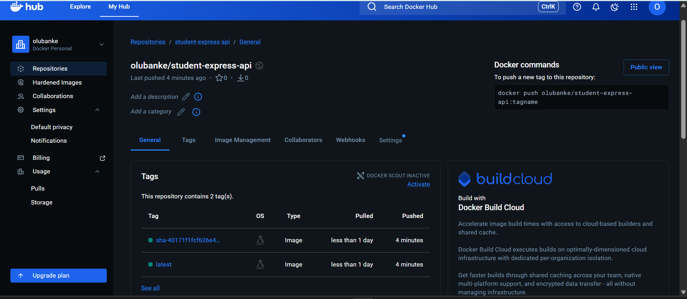

## How tags are generated

The ci-cd pipeline automatically generates two tags for every successful build on the main branch:

Latest: The latest tag always points to the most recent successful build. This is useful for pulling the current production-ready image without needing a specific version number.

Git Commit SHA: Each image is also tagged with the full Git commit SHA (e.g., sha-a1b2c3d...). This provides immutability and traceability, allowing us to identify exactly which version of the source code is running in a specific container instance.

Docker Hub Repository: [https://hub.docker.com/repository/docker/olubanke/student-express-api/general](https://hub.docker.com/repository/docker/olubanke/student-express-api/general)
